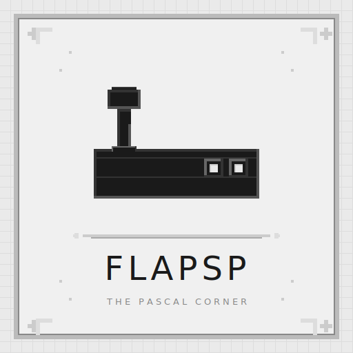

# flapsp — PSP Flash Games

<p align="center">
  
</p>

[](https://en.wikipedia.org/wiki/PlayStation_Portable)
[](FLAPSP/roms/)
[](FLAPSP/generate.ps1)
[](LICENSE)

> **fla**(sh) + **psp** + **p(a)sc(a)l** — tuyển tập game Flash chạy trên PSP OFW, duy trì bởi The Pascal Corner.

---

## Tính năng

- **124 game Flash** — đã kiểm tra trên PSP 3000 OFW
- **Tìm kiếm real-time** — gõ tên game, kết quả hiện ngay
- **JS ES3** — tương thích 100% với PSP NetFront browser
- **Auto-generate** — chạy `generate.ps1` để quét `roms/` và cập nhật danh sách
- **Portable** — chỉ cần copy folder `FLAPSP/` vào PSP, không phụ thuộc file ngoài
- **Dễ mở rộng** — thêm `.swf` vào `roms/`, chạy script, copy lại

---

## Cấu trúc

```
flapsp/
├── FLAPSP/                           ← copy nguyên folder này vào PSP
│   ├── roms/*.swf                    ← game Flash
│   ├── menu.html                     ← giao diện chính (search + danh sách)
│   └── generate.ps1                  ← quét roms/ và cập nhật menu.html
├── assets/logo.svg                   ← logo dự án
├── README.md                         ← file này
├── GUIDE.md                          ← hướng dẫn chi tiết
├── CONTRIBUTING.md                   ← hướng dẫn đóng góp
├── CREDITS.md                        ← ghi công
└── LICENSE                           ← MIT
```

---

## Tech Stack

| Layer | Công nghệ |
|---|---|
| Platform | PSP 1000/2000/3000/Go (OFW) |
| Browser | NetFront (Presto-based, JS ES3) |
| Menu UI | HTML + CSS + JavaScript ES3 |
| Generator | PowerShell 5.1+ |

---

## PSP Compatibility

| Yêu cầu | Chi tiết |
|---|---|
| **Model** | PSP 1000 / 2000 / 3000 / Go / Street (OFW & CFW) |
| **Firmware** | 6.60 / 6.61 |
| **Flash Player** | Kích hoạt 1 lần (Settings → System → Enable Flash Player) |
| **ActionScript** | **AS1 / AS2** — game AS3 không chạy |
| **RAM tối thiểu** | 32 MB (PSP 1000) — game ≤ 5MB; 64 MB (2000/3000) — game ≤ 10MB |

---

## Cách dùng nhanh

```bash
# 1. Copy FLAPSP/ vào root thẻ nhớ PSP
cp -r FLAPSP/ /path/to/psp/

# 2. Trên PSP browser
#    URL: file:/FLAPSP/menu.html
```

### Thêm game mới

```bash
# 1. Copy .swf vào FLAPSP/roms/
cp GameMoi.swf FLAPSP/roms/

# 2. Chạy script để cập nhật menu
powershell -ExecutionPolicy Bypass -File FLAPSP/generate.ps1

# 3. Copy lại FLAPSP/ vào PSP
```

---

## Tác giả

**The Pascal Corner** — [GitHub](https://github.com/The-Pascal-Corner)

---

## License

MIT — xem file [LICENSE](./LICENSE).
